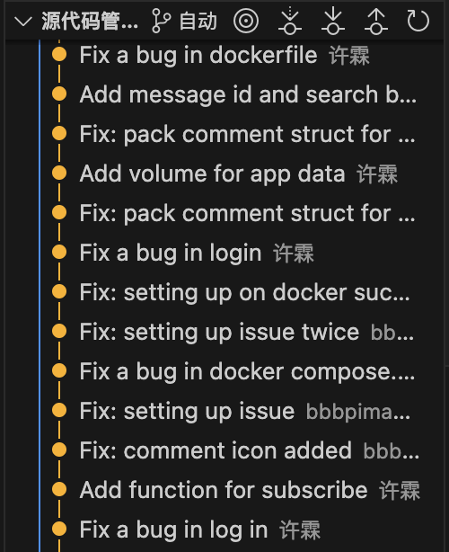

# Git 

## 概述

软件不可能是一次性写好的，而是需要不断地修改、更新和迭代版本。版本管理工具就是用来管理软件开发过程中的各种变化的的工具。**Git** 是使用最广泛的版本管理工具。

大家之前是怎么解决版本管理问题和多人协作问题的呢？

用途：
- 帮助我们管理代码的修改历史。创建项目的快照，记录每个改动的目的、回滚到之前的版本等等。
- 帮助我们和队友协作开发。看到别人对代码进行的修改，同时解决由于并行开发引起的冲突。



当合作开发一个项目时，你可能会有很多问号：
- 当前模块是谁编写的？
- 这个文件的这一行是什么时候被编辑的？是谁作出的修改？修改原因是什么呢？
- 最近的 1000 个版本中，何时/为什么导致了单元测试失败？

而 **git** 可以帮助你解决这些问题！

在实际的软件工程开发当中，我注意到一些同学即使到了大三仍然不熟悉 **git** 的使用。我认为这是由于学校课程对于git的使用一直停留在简单的命令层面，而并没有引导学生理解**git**原理，哪怕是一些基础的概念。很多同学会感到**git**的命令就像黑魔法一样。所以今天我们的课程将会首先带领大家快速的浏览一遍**git**的原理。

## Git 的数据模型

### 文件和目录结构

在 Git 的术语里，文件被称作 Blob 对象。目录则被认为是一棵树，它将名字与 Blob 对象或树对象进行映射（使得目录中可以包含其他目录）。

```
<root> (tree)
|
+- foo (tree)
|  |
|  + bar.txt (blob, contents = "hello world")
|
+- baz.txt (blob, contents = "git is wonderful")
```

这个顶层的树包含了两个元素，一个名为 "foo" 的树（它本身包含了一个 blob 对象 "bar.txt"），以及一个 blob 对象 "baz.txt"。

### 历史记录建模：关联快照

快照是一个目录在某一时刻的状态，包含的信息比如：文件名、文件内容、权限、创建时间、修改时间等等。

版本控制系统和快照有什么关系呢？线性历史记录是一种最简单的模型，它包含了一组按照时间顺序线性排列的快照。把这些快照连起来，不就构成了一个历史记录吗？不过 Git 并没有采用这样的模型。

在 Git 中，历史记录是一个由快照组成的有向无环图。（或许会有同学不太了解这个概念，可以参照离散数学二的教材） 除了第一个快照之外，Git 中的每个快照都有一个或多个“父辈”，也就是其前面的快照。注意，快照可能具有多个“父辈”而非一个，因为某个快照可能由多个父辈而来。例如经过合并（merge）后的两条分支。

在 Git 中，这些快照被称为**commit**。通过可视化的方式来表示这些历史提交记录时，看起来差不多是这样的：

<pre class="highlight">
<code>
o <----- o <----- o <-- o <---- <strong> o </strong>
      author: xl      ^                 /
    message:shit       \               /
                        \            v
                         --- o <-- o
</code>
</pre>

箭头指向了当前**commit**的父辈（这是一种“在...之前”，而不是“在...之后”的关系）。在第三次提交之后，历史记录分岔成了两条独立的分支。这可能因为此时需要同时开发两个不同的特性，它们之间是相互独立的。开发完成后，这些分支可能会被合并并创建一个新的提交，这个新的提交会同时包含这些特性。新的提交会创建一个新的历史记录，看上去像这样（最新的合并提交用粗体标记）：

Git 中的提交是不可改变的。但这并不代表错误不能被修改，只不过这种“修改”实际上是创建了一个全新的提交记录。

### git数据模型伪代码表示

以伪代码表示可能更加清晰：

```
// 文件就是一组数据
type blob = array<byte>

// 一个包含文件和目录的目录
type tree = map<string, tree | blob>

// 每个提交都包含一个父辈，元数据和顶层树
type commit = struct {
    parents: array<commit>
    author: string
    message: string
    snapshot: tree
}
```

Git 中的对象可以是 blob、树或提交：

```
type object = blob | tree | commit
```

Git 在储存数据时，所有的对象都会基于它们的 [SHA-1 哈希](https://en.wikipedia.org/wiki/SHA-1) 进行寻址。

```
objects = map<hashvalue, object>

def store(object):
    id = sha1(object)
    objects[id] = object

def load(id):
    return objects[id]
```

這是一個上等的模型。

这里用 `git cat-file -p <id>` 命令可以查看对象内容。

### 引用

现在所有的快照都可以通过它们的 SHA-1 哈希值来标记了。但这也太不方便了。

针对这一问题，Git 的解决方法是给这些哈希值赋予人类可读的名字，也就是引用（references）。引用是指向提交的指针。与对象不同的是，它是可变的（引用可以被更新，指向新的提交）。

这样，Git 就可以使用诸如 "master" 这样人类可读的名称来表示历史记录中某个特定的提交，而不需要在使用一长串十六进制字符了。

有一个细节需要我们注意， 通常情况下，我们会想要知道“我们当前所在位置”，并将其标记下来。这样当我们创建新的快照的时候，我们就可以知道它的相对位置（如何设置它的“父辈”）。在 Git 中，我们当前的位置有一个特殊的索引，它就是 "HEAD"，指向当前所在的提交。

### 仓库

最后，我们可以粗略地给出 Git 仓库的定义了：`对象` 和 `引用`。

在硬盘上，Git 仅存储对象和引用：因为其数据模型仅包含这些东西。**所有的 `git` 命令都对应着对提交树的操作，例如增加对象，增加或删除引用。**

**当您输入某个指令时，请思考一下这条命令是如何对底层的图数据结构进行操作的。**

## Git 的命令行接口

我不会详细解释以下命令行。强烈推荐阅读 [Pro Git 中文版](https://git-scm.com/book/zh/v2) 。


### 基础

The `git init` command initializes a new Git repository, with repository
metadata being stored in the `.git` directory:

```console
$ mkdir myproject
$ cd myproject
$ git init
Initialized empty Git repository in /home/missing-semester/myproject/.git/
$ git status
On branch master

No commits yet

nothing to commit (create/copy files and use "git add" to track)
```

How do we interpret this output? "No commits yet" basically means our version
history is empty. Let's fix that.

```console
$ echo "hello, git" > hello.txt
$ git add hello.txt
$ git status
On branch master

No commits yet

Changes to be committed:
  (use "git rm --cached <file>..." to unstage)

        new file:   hello.txt

$ git commit -m 'Initial commit'
[master (root-commit) 4515d17] Initial commit
 1 file changed, 1 insertion(+)
 create mode 100644 hello.txt
```

With this, we've `git add` ed a file to the staging area, and then `git
commit`ed that change, adding a simple commit message " Initial commit ". If we
didn't specify a `-m` option, Git would open our text editor to allow us type a
commit message.

Now that we have a non-empty version history, we can visualize the history.
Visualizing the history as a DAG can be especially helpful in understanding the
current status of the repo and connecting it with your understanding of the Git
data model.

The `git log` command visualizes history. By default, it shows a flattened
version, which hides the graph structure. If you use a command like `git log
--all --graph --decorate`, it will show you the full version history of the
repository, visualized in graph form.

```console
$ git log --all --graph --decorate
* commit 4515d17a167bdef0a91ee7d50d75b12c9c2652aa (HEAD -> master)
  Author: Missing Semester <missing-semester@mit.edu>
  Date:   Tue Jan 21 22:18:36 2020 -0500

      Initial commit
```

This doesn't look all that graph-like, because it only contains a single node.
Let's make some more changes, author a new commit, and visualize the history
once more.

```console
$ echo "another line" >> hello.txt
$ git status
On branch master
Changes not staged for commit:
  (use "git add <file>..." to update what will be committed)
  (use "git checkout -- <file>..." to discard changes in working directory)

        modified:   hello.txt

no changes added to commit (use "git add" and/or "git commit -a")
$ git add hello.txt
$ git status
On branch master
Changes to be committed:
  (use "git reset HEAD <file>..." to unstage)

        modified:   hello.txt

$ git commit -m 'Add a line'
[master 35f60a8] Add a line
 1 file changed, 1 insertion(+)
```

Now, if we visualize the history again, we'll see some of the graph structure:

```
* commit 35f60a825be0106036dd2fbc7657598eb7b04c67 (HEAD -> master)
| Author: Missing Semester <missing-semester@mit.edu>
| Date:   Tue Jan 21 22:26:20 2020 -0500
|
|     Add a line
|
* commit 4515d17a167bdef0a91ee7d50d75b12c9c2652aa
  Author: Anish Athalye <me@anishathalye.com>
  Date:   Tue Jan 21 22:18:36 2020 -0500

      Initial commit
```

Also, note that it shows the current HEAD, along with the current branch
(master).

We can look at old versions using the `git checkout` command.

```console
$ git checkout 4515d17  # previous commit hash; yours will be different
Note: checking out '4515d17'.

You are in 'detached HEAD' state. You can look around, make experimental
changes and commit them, and you can discard any commits you make in this
state without impacting any branches by performing another checkout.

If you want to create a new branch to retain commits you create, you may
do so (now or later) by using -b with the checkout command again. Example:

  git checkout -b <new-branch-name>

HEAD is now at 4515d17 Initial commit
$ cat hello.txt
hello, git
$ git checkout master
Previous HEAD position was 4515d17 Initial commit
Switched to branch 'master'
$ cat hello.txt
hello, git
another line
```

Git can show you how files have evolved (differences, or diffs) using the `git
diff` command:

```console
$ git diff 4515d17 hello.txt
diff --git c/hello.txt w/hello.txt
index 94bab17..f0013b2 100644
--- c/hello.txt
+++ w/hello.txt
@@ -1 +1,2 @@
 hello, git
 +another line
```



- `git help <command>`: 获取 git 命令的帮助信息
- `git init`: 创建一个新的 git 仓库，其数据会存放在一个名为 `.git` 的目录下
- `git status`: 显示当前的仓库状态
- `git add <filename>`: 添加文件到暂存区
- `git commit`: 创建一个新的提交
    - 如何编写 [良好的提交信息](https://tbaggery.com/2008/04/19/a-note-about-git-commit-messages.html)!
    - 为何要 [编写良好的提交信息](https://chris.beams.io/posts/git-commit/)
- `git log`: 显示历史日志
- `git log --all --graph --decorate`: 可视化历史记录（有向无环图）
- `git diff <filename>`: 显示与暂存区文件的差异
- `git diff <revision> <filename>`: 显示某个文件两个版本之间的差异
- `git checkout <revision>`: 更新 HEAD 和目前的分支

### 分支和合并

Branching allows you to "fork" version history. It can be helpful for working
on independent features or bug fixes in parallel. The `git branch` command can
be used to create new branches; `git checkout -b <branch name>` creates and
branch and checks it out.

Merging is the opposite of branching: it allows you to combine forked version
histories, e.g. merging a feature branch back into master. The `git merge`
command is used for merging.

- `git branch`: 显示分支
- `git branch <name>`: 创建分支
- `git checkout -b <name>`: 创建分支并切换到该分支
    - 相当于 `git branch <name>; git checkout <name>`
- `git merge <revision>`: 合并到当前分支
- `git mergetool`: 使用工具来处理合并冲突
- `git rebase`: 将一系列补丁变基（rebase）为新的基线

### 远端操作

- `git remote`: 列出远端
- `git remote add <name> <url>`: 添加一个远端
- `git push <remote> <local branch>:<remote branch>`: 将对象传送至远端并更新远端引用
- `git branch --set-upstream-to=<remote>/<remote branch>`: 创建本地和远端分支的关联关系
- `git fetch`: 从远端获取对象/索引
- `git pull`: 相当于 `git fetch; git merge`
- `git clone`: 从远端下载仓库

### 撤销

- `git commit --amend`: 编辑提交的内容或信息
- `git reset HEAD <file>`: 恢复暂存的文件
- `git checkout -- <file>`: 丢弃修改
- `git restore`: git2.32 版本后取代 git reset 进行许多撤销操作

### Git 高级操作

- `git config`: Git 是一个 [高度可定制的](https://git-scm.com/docs/git-config) 工具
- `git clone --depth=1`: 浅克隆（shallow clone），不包括完整的版本历史信息
- `git add -p`: 交互式暂存
- `git rebase -i`: 交互式变基
- `git blame`: 查看最后修改某行的人
- `git stash`: 暂时移除工作目录下的修改内容
- `git bisect`: 通过二分查找搜索历史记录
- `.gitignore`: [指定](https://git-scm.com/docs/gitignore) 故意不追踪的文件
